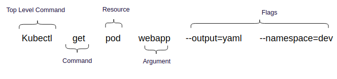
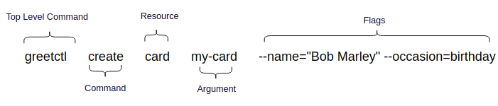
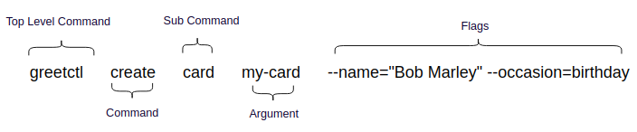

# Creating kubectl like CLI With GO And Cobra.
We are using CLI tools for ages. You might be familiar with the CLI tools like git, docker, kubectl, awscli, etc. Here I have created a fictional CLI named greetctl. This tool is implemented in golang with the help of the cobra library. For more details please visit [this blog](https://blog.knoldus.com/create-kubectl-like-cli-with-go-and-cobra/).

In Kubernetes, almost all the APIs can be accessed using kubectl. It is an amazing tool. Following is the syntax of kubectl.



In this sample project, I have created a KubeCtl like tool named greetctl. It creates customized greeting cards for different occasions like birthdays, new year, thanksgiving in different languages like English, French, etc. I am calling this CLI greetctl.

### Specifications of the CLI is given below.

| ToolName  | Commands | Resources |Resource-name | Parameters |
|--|--|--|--|--|
|  greetctl| create, get|cards, quotes ( in the future we might be adding more resources ;) )| any random string to identify resource | --name (-n) : Name of the user. <br>--language (-l) : english (en), french (fr)<br>--occasion (-o): birthday, newyear, diwali, thanksgiving, christmas |

### Syntax of GreetCTL

> greetctl {command} {resource} {resource-name} {parameters ..}



I implemented the solution in GO with the help of the Cobra library. Popular CLIs like kubectl, etcdctl, docker is built on this awesome library. Cobra is built on a structure of commands, arguments & flags. Let fit our CLI structure in this framework. Commands represent actions, Args are things and Flags are modifiers for those actions. Since there is no concept of resources in Cobra so we will mark it as sub-command. The above syntax can be rewritten as follows

> greetctl {command} {subcommand} {args..} {flags..}



# Installation
```
go run main.go
go install greetctl
```

# Play with greetctl
> $ greetctl create card -h

```
This command creates cards. Example:
	greetctl create card eva -n="Eva Green" -o=thanksgiving -l=fr
	greetctl create card bob --name="Bob Marley" --occasion=birthday

Usage:
  greetctl create card <name> [flags]

Flags:
  -h, --help              help for card
  -l, --language string   Possible values: en, fr (default "en")
  -n, --name string       Name of the user to whom you want to greet
  -o, --occasion string   Possible values: newyear, thanksgiving, birthday

```

> $ greetctl create card bob --name="Bob Marley" --occasion=birthday

```
card with id [bob] has been created
```
>greetctl create card eva -n="Eva Green" -o=thanksgiving -l=fr
```
card with id [eva] has been created
```
> greetctl get card eva
```
Joyeux Action de Graces!! Eva Green 
```
